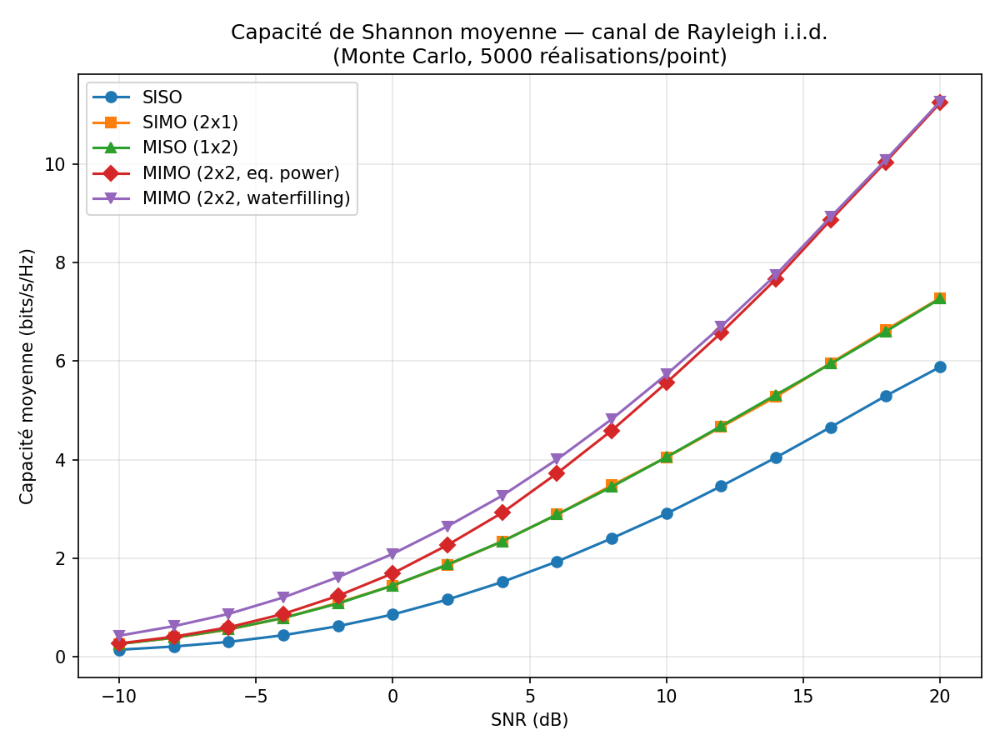
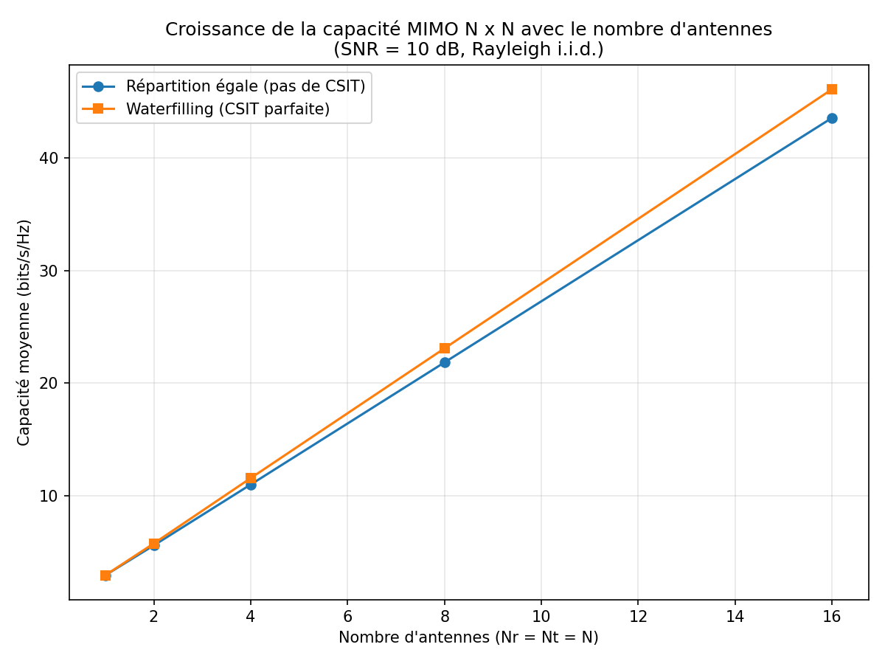
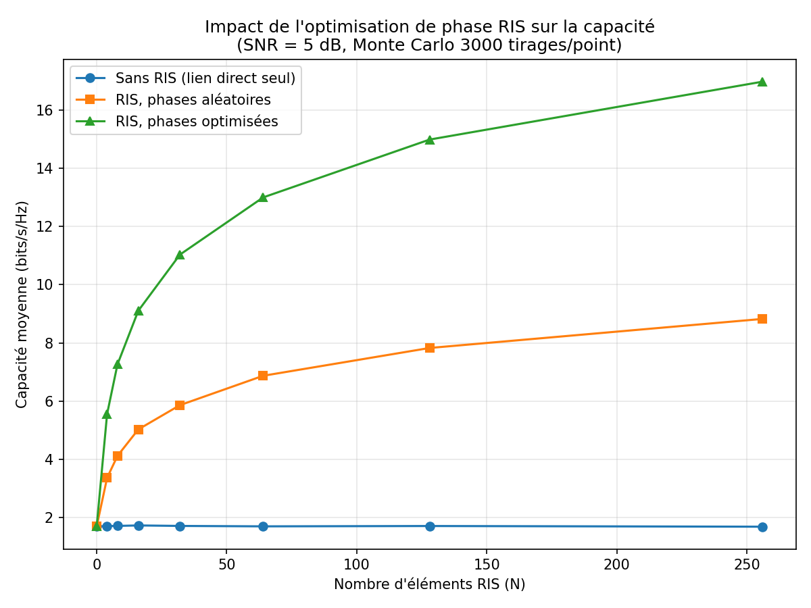
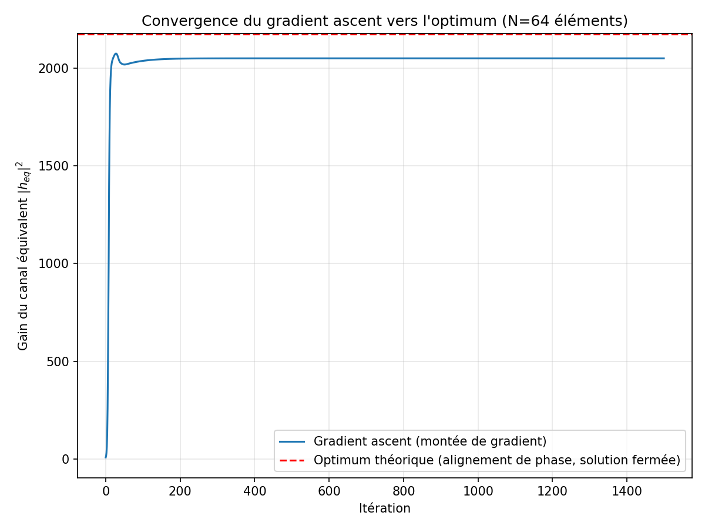

# MIMO / RIS — Capacité de Shannon & Optimisation de phase

**Comparatif SISO / SIMO / MISO / MIMO (capacité de Shannon) et optimisation
de la phase d'une RIS (Reconfigurable Intelligent Surface) pour maximiser
le SNR reçu.**

> Projet réalisé en Python (NumPy/SciPy/Matplotlib), simulations Monte Carlo,

---

## 1. Contexte et objectifs

Les surfaces intelligentes reconfigurables (RIS) sont l'une des technologies
clés étudiées pour la 6G : des surfaces passives (il y a aussi des implémentation active) composées de nombreux
éléments réfléchissants dont on peut contrôler individuellement la phase,afin de reconfigurer l'environnement de propagation sans amplification
active du signal.

Ce projet a deux objectifs :

1. **Rappeler et illustrer numériquement** la capacité de Shannon des
   quatre configurations d'antennes classiques (SISO, SIMO, MISO, MIMO)
   sur canal à évanouissement de Rayleigh, avec et sans connaissance du
   canal à l'émission (CSIT).
2. **Modéliser une liaison assistée par RIS** et résoudre le problème
   d'optimisation de phase qui maximise le SNR reçu, en comparant :
   - une solution analytique fermée (alignement de phase),
   - une validation numérique par montée de gradient.

---

## 2. Rappels théoriques

### 2.1 Capacité de Shannon par configuration

Pour un canal `y = Hx + n`, bruit blanc gaussien, SNR moyen par antenne
d'émission noté `SNR` :

| Configuration | Formule | Hypothèse |
|---|---|---|
| SISO | `C = log2(1 + SNR·\|h\|²)` | lien unique |
| SIMO (Nr antennes Rx) | `C = log2(1 + SNR·‖h‖²)` | combinaison à gain maximal (MRC), optimale en bruit blanc |
| MISO (Nt antennes Tx) | `C = log2(1 + SNR·‖h‖²)` | précodage MRT, CSIT parfaite |
| MIMO (Nr×Nt), sans CSIT | `C = log2 det(I + (SNR/Nt)·HHᴴ)` | répartition égale de puissance |
| MIMO (Nr×Nt), avec CSIT | waterfilling sur les valeurs propres de `HᴴH` | allocation de puissance optimale |

Le MIMO avec waterfilling est toujours ≥ à la répartition égale de
puissance (propriété vérifiée par test unitaire dans `tests/`), et le gain
de multiplexage spatial du MIMO se traduit par une pente de capacité en
fonction du SNR proportionnelle à `min(Nr, Nt)`, contre une pente fixe
pour SISO/SIMO/MISO.

### 2.2 Modèle de canal RIS et optimisation de phase

Liaison SISO assistée par une RIS à `N` éléments passifs, avec lien
direct `h_d` (souvent obstrué) et liaison en cascade BS→RIS→User :

```
h_eq = h_d + Σ_{i=1}^{N} h_1[i] · h_2[i] · e^{jθ_i}
```

où `θ_i` est la phase imposée par l'élément `i` de la RIS (gain
d'amplitude idéal = 1). Le SNR reçu est proportionnel à `|h_eq|²`. La
maximisation de `|h_eq|²` par rapport aux `θ_i` admet une **solution
fermée** : chaque terme réfléchi doit être mis en phase avec le lien
direct,

```
θ_i* = arg(h_d) − arg(h_1[i]·h_2[i])
```

Cette solution est validée numériquement dans ce projet par une montée de
gradient sur `f(θ) = |h_eq(θ)|²` (gradient dérivé analytiquement, voir `src/ris.py`), qui converge vers le même optimum.

---

## 3. Structure du projet

```
mimo-ris-project/
├── src/
│   ├── channels.py     # génération des canaux Rayleigh (SISO/SIMO/MISO/MIMO) + canal RIS
│   ├── capacity.py     # capacité de Shannon (MRC, MRT, équirépartition, waterfilling)
│   └── ris.py          # modèle RIS + optimisation de phase (fermée + gradient)
├── scripts/
│   ├── run_comparison.py         # Monte Carlo : capacité vs SNR, capacité vs nb d'antennes
│   └── run_ris_optimization.py   # Monte Carlo : gain RIS vs nb d'éléments, convergence gradient
├── tests/
│   └── test_capacity_ris.py      # tests unitaires (cohérence des formules, optimalité RIS)
├── figures/             # résultats générés (PNG)
├── requirements.txt
└── README.md
```

---

## 4. Installation et exécution

```bash
git clone https://github.com/saif1eddine1ghnimi/mimo-ris-shannon-capacity.git
cd mimo-ris-shannon-capacity
pip install -r requirements.txt

# Tests unitaires
python tests/test_capacity_ris.py

# Simulations (génèrent les figures dans figures/)
python scripts/run_comparison.py
python scripts/run_ris_optimization.py
```

---

## 5. Résultats

### 5.1 Capacité moyenne vs SNR (SISO/SIMO/MISO/MIMO, Rayleigh i.i.d.)

 


Le MIMO 2×2 domine largement les autres configurations à fort SNR grâce
au **multiplexage spatial** (deux flux de données en parallèle), tandis
que SIMO/MISO n'apportent qu'un **gain de diversité/array** (translation
de la courbe SISO, pas de changement de pente). Le waterfilling n'apporte
un gain visible qu'à faible/moyen SNR (à fort SNR, l'allocation optimale
tend vers l'équirépartition).

### 5.2 Capacité MIMO vs nombre d'antennes (SNR = 10 dB)



La capacité croît quasi linéairement avec `N` pour un système `N×N`,
illustrant le gain de multiplexage spatial `min(Nr,Nt)` propre au MIMO.

### 5.3 Impact de l'optimisation de phase RIS (SNR = 5 dB, lien direct faible)



Gain de capacité apporté par la RIS à phases optimisées, par rapport au
lien direct seul (Monte Carlo, 3000 tirages/point) :

| N (éléments RIS) | Gain de capacité |
|---:|---:|
| 4   | +3.84 bits/s/Hz |
| 8   | +5.54 bits/s/Hz |
| 16  | +7.37 bits/s/Hz |
| 32  | +9.31 bits/s/Hz |
| 64  | +11.29 bits/s/Hz |
| 128 | +13.26 bits/s/Hz |
| 256 | +15.27 bits/s/Hz |

Ce comportement est cohérent avec la théorie : le gain de puissance
apporté par l'alignement de phase croît en **O(N²)** (chaque terme
réfléchi s'ajoute de façon cohérente), soit un gain de SNR en dB
croissant approximativement comme `20·log10(N)`, ce qui se traduit ici
par un gain de capacité quasi linéaire en `log2(N)`. Avec des phases
aléatoires (non optimisées), la combinaison est incohérente et le gain
est bien plus faible — ce qui justifie l'intérêt de l'optimisation.

### 5.4 Validation numérique : gradient ascent vs solution fermée



La montée de gradient sur `|h_eq(θ)|²` converge vers la même valeur que
la solution analytique d'alignement de phase, ce qui valide à la fois
la dérivation théorique et son implémentation.

